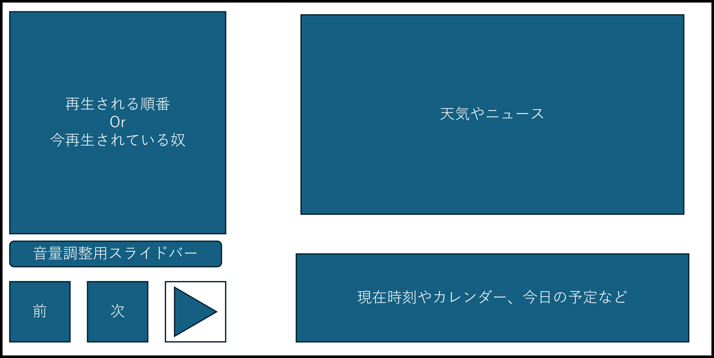
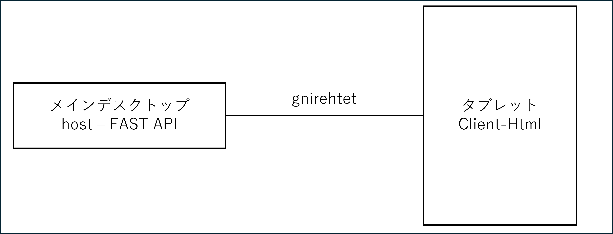
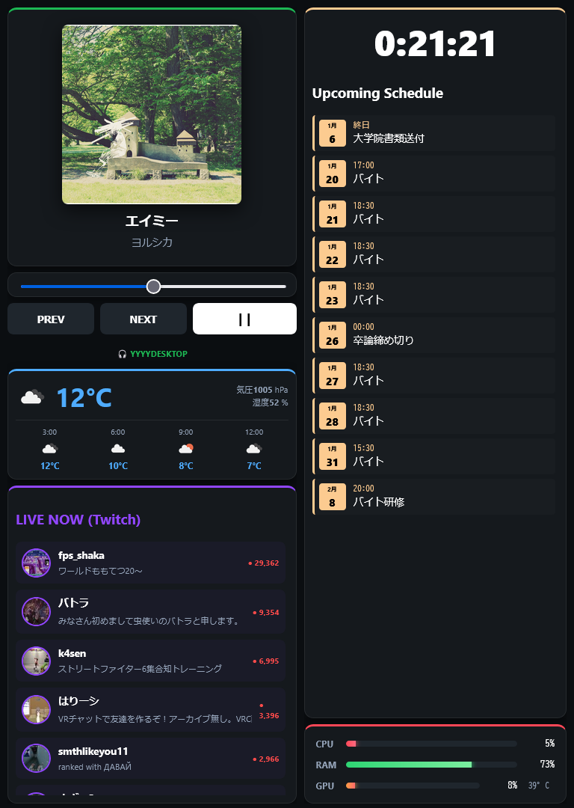

# pi-android-dashboard

## 経緯

youtubeで[4,000円で理想のスマートディスプレイを作ってみた（＋遊んでみた）](https://youtu.be/1P6iwjQkPDw)っていう動画を見ていいなーーと思った。それで手元に謎の中華Androidタブレットが余っていたので作製。

## 構想

よくSpotifyで音楽を聴くのでPCで手元でコントロールできるようにしたい。動画みたいに天気予報やカレンダー、予定などを表示したい。こんな感じの物を作りたい。

## 構成

windows11のメインPCをHostとしてgnirehtet経由で中華タブレットに通信をする。gnirehtet経由で通信を行っている理由として中華タブレットのWiFiカードが貧弱で通信が不安定のため。

## 成果

実装した機能

- Spotifyコントローラー
- 天気
- Twitch配信
- 時間とGoogle Calendarの予定
- CPUやGPUのモニタ
